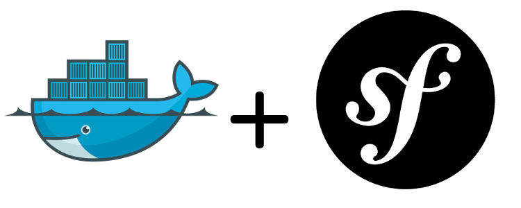

# Docker and Symfony4

Symfony4.4 template project to deploy dev or prod environment inside docker container.



## 1. Environment configuration

### 1.1. Docker image php:7.3-apache-stretch
- Debian: v9.5
- PHP: v7.3
- Apache: v2.4.25
  
### 1.2. Dockerfile:
- NodeJS: v12.6
- Yarn: 1.17.3
- Composer: 1.8.6

## 2. Project configuration

### 2.1. Composer:
- Symfony: v4.4
 
### 2.2. Yarn:
- Webpack: v4.36
- Bootstrap: v4.3
- FontAwesome: v5.9

## 3. Installation script
- [Development environment](readme/installation/dev.md)
- [Production environment](readme/installation/prod.md)

## 4. Update script
- [Docker image](readme/update/docker-image.md)
- [Website project](readme/update/website-project.md)

## 5. Get started
To use this symfony4 project, you will need clone, rename some files and variables, then commit to your git server.

### 5.1. Clone project
```bash
cd /{your-projects-folder};
git clone git@github.com:danielbackes/symfony4.4.git {project-name};
```

### 5.2. Virtual Host
- Inside the follow files, replace `{project-name}` occurrences for your project name:
    - environment/dev/config/vhost.conf
    - environment/prod/config/vhost.conf

### 5.3. SSL/TLS
- Get a SSL/TLS certificate with some certifier e put inside the follow files:
    - environment/dev/config/ssl/certs/{project-name}.pem
    - environment/dev/config/ssl/private/{project-name}.pem
    - environment/prod/config/ssl/certs/{project-name}.pem 
    - environment/prod/config/ssl/private/{project-name}.pem

### 5.4. Create docker scripts
- Inside the files bellow, replace `{project-name}` and `{docker-hub-username}` occurrences:
    - environment/dev/app-build.sh
    - environment/dev/app-watch.sh
    - environment/dev/env-bash.sh
    - environment/dev/env-build.sh
    - environment/dev/env-run.sh
    - environment/prod/app-build.sh
    - environment/prod/env-bash.sh
    - environment/prod/env-build.sh
    - environment/prod/env-run.sh


### 5.5. Fix README
- In your cloned project edit `README.md` file and remove the entire `5. Get started` session. This session just teach how config your project from this sample symfony4 project, so you will not need it in your new project.
- Replace `{docker-hub-username}`, `{project-name}` and `{symfony4-project-git-path}` occurrences in the follow files:
    - readme/installation/dev.md
    - readme/installation/prod.md
    - readme/update/docker-image.md
    - readme/update/website-project.md

### 5.6. Commit project

```bash
cd /{your-projects-folder}/{project-name};
rm -rf .git;
git init;
git add .;
git commit -m "First commit";
git remote add origin {symfony4-project-git-path};
git push origin master;
```

### 5.7. Test
 Now your symfony4 project was created and saved. To make sure that it's work, lets remove them and follow the `3. Installation script` session of your project's README.

```bash
rm -rf /{your-projects-folder}/{project-name};
```


